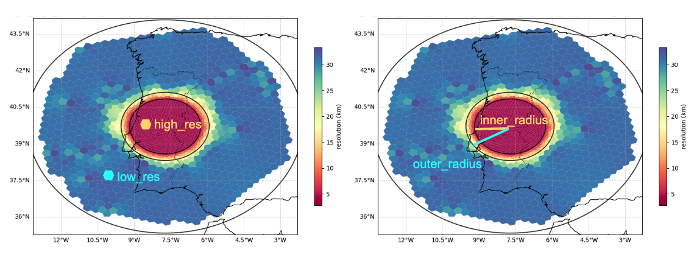

# Tutorial for generating personalized meshes for MONAN

## 1) First steps in EGEON
To start our exercise, we first need to log in into EGEON and set up a conda environment, which will be needed to execute some of the steps in running a MONAN simulation.

### 1.1) Log in

In your terminal, write
```
ssh -Y $USER@egeon-login.cptec.inpe.br
```
entering in `$USER` the username you received from the organization team. You will then be prompted to give your password, which you should have received as well.

### 1.2) Load the anaconda module

Once you are in, load the anaconda module by
```
module load anaconda3-2022.05-gcc-11.2.0-q74p53i
```

### 1.3) Configure shell to use conda
Start with the command
```
conda init
```
Then, do
```
source ~/.bashrc
```

### 1.4) Make sure you have access to our conda environment

Write the command
```
conda config --add envs_dirs /pesq/share/monan/curso_OMM_INPE_2025/.conda/envs
```

### 1.5) Test if you can activate our conda environment

Write the command
```
conda activate vtx_env
```

If you see "(vtx_env)" in front of your username in the terminal, you're all set to start!

## 2) Cloning scripts repository
Our second step is to clone the repository `scripts_CD-CT`, which contains all the code needed to run a MONAN simulation.

### 2.1) Go to your work directory:
```
cd /mnt/beegfs/$USER
```
### 2.2) Clone the scripts repository:

```
git clone -b feature/scripts-849-NF-idealized https://github.com/CGFD-USP/scripts_CD-CT
```

## 3) Generating MONAN meshes
Now that you have the scripts repository, we can start generating meshes. In this tutorial you will generate three types of mesh:

1) A **uniform global mesh**, i.e. a mesh with cells approximately the same size all over the globe. This type of mesh will be used in our first exercise with MONAN, where we will perform an idealized global simulation taking artificial initial conditions;

2) A **refined global mesh**, i.e. a mesh where the size of cells decreases over a particular region of interest where one wants detailed information of simulated phenomena. This type of mesh will be used both in our first exercise with MONAN, for comparison with uniform global meshes, and in our second exercise, where we will simulate an actual cyclone that happened in the La Plata region in 2007;

3) A **refined regional mesh**, i.e. a mesh where as above the size of cells decreases over a region of interest, but where the rest of the globe is cut off so that one can perform the simulation only over that particular region, thereby saving a lot of computational time. This type of mesh will be used for the cases we will study over the next days of the course.

To start generating our meshes, we need to tell the code our username so that it knows where to look for the mesh generation algorithm and where to save our meshes. To do this, follow steps 3.1) and 3.2) below.


### 3.1) Substitute in mesh_input_file.txt the placeholder $USER by your actual username
```
sed -i "s|\\\$USER|$USER|g" mesh_input_file.txt
```

### 3.2) Check in mesh_input_file.txt if your username is actually there
To check this, open the file with the text editor
```
vi mesh_input_file.txt
```
After opening the file, make sure that the variables ending in "`_dir`" contain a directory using your actual username. For example, if the username is `guilherme.mendonca`, you should see:
```
exp_dir=/mnt/beegfs/guilherme.mendonca/scripts_CD-CT/scripts
vtx_mpas_meshes_dir=/mnt/beegfs/guilherme.mendonca/scripts_CD-CT/sources/CGFD-USP-Create-Mesh/vtx-mpas-meshes
meshes_dir=/mnt/beegfs/guilherme.mendonca/scripts_CD-CT/datain/fixed
```
Check if these three lines contain your username. If so, we are ready to generate our meshes!
 
### 3.3) Uniform global mesh
We start with the uniform global mesh. Still in `mesh_input_file.txt`, you can edit the characteristics of your mesh. These characteristics are generally set by the variables
```
## Coordinates of mesh center
lon=-30
lat=-50
## Inner and outer radius (km)
inner_radius=2000
outer_radius=2800
## Number of external layers for r > outer_radius
n_layers=8
## High resolution for r < inner_radius
high_res=240
## Low resolution for r > outer_radius
low_res=600
## Whether to cut regional mesh (y/n)
do_regional=n
## Grid type (doughnut/constant)
grid_type=constant
```

Most of these parameters only make sense when thinking about a refined mesh. For this first exercise with a uniform mesh, the only parameters we have to worry about are `high_res`, which will define the resolution of our mesh (in km), `do_regional`, which defines whether we want a global or a regional mesh, and `grid_type`, which defines whether our mesh will have constant resolution or will be refined.

For our uniform global mesh, make sure the following values are set:
```
high_res=240
do_regional=n
grid_type=constant
```

Please leave the remaining parameters as they are. Now save and exit the file (command :wq).

#### 3.3.1) Generate the mesh

Now, you can generate the mesh by executing
```
bash 2.create_mesh.bash
```

#### 3.3.2) Plot the mesh

After `2.create_mesh.bash` finishes running, we can plot the generated mesh. To do that, first get the geographical files needed for the plot:

```
mkdir -p "/home/$USER/.local/share" && cp -r /pesq/share/monan/curso_OMM_INPE_2025/.local/share/cartopy "/home/$USER/.local/share/"
```

Now, edit the file plot_mpas_grid.bash:
```
vi plot_mpas_grid.bash
```

In GFILEPATH, add the name of the mesh you just generated after ${DATAIN}/fixed/, for example:
```
## Grid file
GFILEPATH=${DATAIN}/fixed/lat_50_lon_-30_oradius_2800_iradius_2000_margin_800_hres_240_lres_600.region.grid.nc
```

In POSTFILEPATH, add the directory you want to save the plot, for example:
```
## Output directory and filename to save plot
POSTFILEPATH=${DATAIN}/fixed/lat_50_lon_-30_oradius_2800_iradius_2000_margin_800_hres_240_lres_600.region.grid.png
```

Save and exit (:wq) plot_mpas_grid.bash, then run the script:
```
bash plot_mpas_grid.bash
```

After the plot is done, you may or may not be able to open the plot in EGEON. You can try by 

```
module load imagemagick-7.0.8-7-gcc-11.2.0-46pk2go
display /mnt/beegfs/$USER/scripts_CD-CT/datain/fixed/$MESH.grid.png
```
where in `$MESH` you use the name of your generated mesh (see `POSTFILEPATH` above).

If this does not work, you need to copy the plot to your local machine to then open it locally. This can be done by opening another terminal, then doing
```
scp $USER@egeon.cptec.inpe.br:/mnt/beegfs/$USER/scripts_CD-CT/datain/fixed/$MESH.grid.png .
```
where `$USER` is your username and `$MESH` the name of your mesh.

The result should look like the following:


### 3.3) Refined global mesh
We now proceed to the refined global mesh. Open again `mesh_input_file.txt` with vi:
```
vi mesh_input_file.txt
```
Now, the remaining parameters we ignored in the last section become important. A refined mesh looks something like this:




As shown in the figure, `high_res`and `low_res` indicate the resolution inside and outside our region of interest. Parameters `inner_radius` and `outer_radius` indicate the radius of the internal part of this region, where the resolution is equal to `high_res`, and the radius of the external region, where the resolution is equal to `low_res`; the difference between these parameters give the size of the transition region where the resolution changes. Important are now also `lat` and `lon`, which give the center of this region of interest.

For our refined global mesh, please set the parameters as follows:
```
## Coordinates of mesh center
lon=-30
lat=-50
## Inner and outer radius (km)
inner_radius=2000
outer_radius=2800
## Number of external layers for r > outer_radius
n_layers=8
## High resolution for r < inner_radius
high_res=48
## Low resolution for r > outer_radius
low_res=240
## Whether to cut regional mesh (y/n)
do_regional=n
## Grid type (doughnut/constant)
grid_type=doughnut
# Automatic additions
```
where now `grid_type=doughnut` indicates that we want the refinement.

**Important: Delete the last line file_name=lat_50_lon_-30_oradius_2800_iradius_2000_margin_800_hres_240_lres_600.region**, because it refers to the mesh we generated in the previous section.

Save and exit the file (command :wq).

#### 3.3.1) Generate the mesh

Now, you can generate the mesh by executing
```
bash 2.create_mesh.bash
```

#### 3.3.2) Plot the mesh

To plot the mesh, edit the file plot_mpas_grid.bash:
```
vi plot_mpas_grid.bash
```

In GFILEPATH, add the name of the mesh you just generated after ${DATAIN}/fixed/, for example:
```
## Grid file
GFILEPATH=${DATAIN}/fixed/lat_50_lon_-30_oradius_2800_iradius_2000_margin_800_hres_48_lres_240.region.grid.nc
```

In POSTFILEPATH, add the directory you want to save the plot, for example:
```
## Output directory and filename to save plot
POSTFILEPATH=${DATAIN}/fixed/lat_50_lon_-30_oradius_2800_iradius_2000_margin_800_hres_48_lres_240.region.grid.png
```

Save and exit (:wq) plot_mpas_grid.bash, then run the script:
```
bash plot_mpas_grid.bash
```

After the plot is done, you may or may not be able to open the plot in EGEON. You can try by 

```
module load imagemagick-7.0.8-7-gcc-11.2.0-46pk2go
display /mnt/beegfs/$USER/scripts_CD-CT/datain/fixed/$MESH.grid.png
```
where in `$MESH` you use the name of your generated mesh (see `POSTFILEPATH` above).

If this does not work, you need to copy the plot to your local machine to then open it locally. This can be done by opening another terminal, then doing
```
scp $USER@egeon.cptec.inpe.br:/mnt/beegfs/$USER/scripts_CD-CT/datain/fixed/$MESH.grid.png .
```
where `$USER` is your username and `$MESH` the name of your mesh.

The result should look like this:


### 3.4) Refined regional mesh
We now proceed to the refined regional mesh. Open again `mesh_input_file.txt` with vi:
```
vi mesh_input_file.txt
```
Now, the only difference to the refined global mesh is that we want our mesh to be regional. For this, we just have to set `do_regional=y`. Hence, set the parameters as follows:
```
## Coordinates of mesh center
lon=-30
lat=-50
## Inner and outer radius (km)
inner_radius=2000
outer_radius=2800
## Number of external layers for r > outer_radius
n_layers=8
## High resolution for r < inner_radius
high_res=48
## Low resolution for r > outer_radius
low_res=240
## Whether to cut regional mesh (y/n)
do_regional=y
## Grid type (doughnut/constant)
grid_type=doughnut
# Automatic additions
```

**Important: Delete the last line file_name=lat_50_lon_-30_oradius_2800_iradius_2000_margin_800_hres_48_lres_240.region**, because it refers to the mesh we generated in the previous section.

Save and exit the file (command :wq).

#### 3.3.1) Generate the mesh

Before you generate this mesh, make sure the previous mesh is not overwritten by doing

```
mv ../datain/fixed/lat_50_lon_-30_oradius_2800_iradius_2000_margin_800_hres_48_lres_240.region.grid.nc ../datain/fixed/lat_50_lon_-30_oradius_2800_iradius_2000_margin_800_hres_48_lres_240.region.grid_GLOBAL.nc

mv ../datain/fixed/lat_50_lon_-30_oradius_2800_iradius_2000_margin_800_hres_48_lres_240.region.graph.info ../datain/fixed/lat_50_lon_-30_oradius_2800_iradius_2000_margin_800_hres_48_lres_240.region.graph.info_GLOBAL.nc

mv ../datain/fixed/lat_50_lon_-30_oradius_2800_iradius_2000_margin_800_hres_48_lres_240.region ../datain/fixed/lat_50_lon_-30_oradius_2800_iradius_2000_margin_800_hres_48_lres_240.region_GLOBAL

mv ../datain/fixed/lat_50_lon_-30_oradius_2800_iradius_2000_margin_800_hres_48_lres_240.region.grid.png ../datain/fixed/lat_50_lon_-30_oradius_2800_iradius_2000_margin_800_hres_48_lres_240.region.grid_GLOBAL.png
```

Now, you can generate the mesh by executing
```
bash 2.create_mesh.bash
```

#### 3.3.2) Plot the mesh

To plot the mesh, edit the file plot_mpas_grid.bash:
```
vi plot_mpas_grid.bash
```

In GFILEPATH, add the name of the mesh you just generated after ${DATAIN}/fixed/, for example:
```
## Grid file
GFILEPATH=${DATAIN}/fixed/lat_50_lon_-30_oradius_2800_iradius_2000_margin_800_hres_48_lres_240.region.grid.nc
```

In POSTFILEPATH, add the directory you want to save the plot, for example:
```
## Output directory and filename to save plot
POSTFILEPATH=${DATAIN}/fixed/lat_50_lon_-30_oradius_2800_iradius_2000_margin_800_hres_48_lres_240.region.grid.png
```

Save and exit (:wq) plot_mpas_grid.bash, then run the script:
```
bash plot_mpas_grid.bash
```

After the plot is done, you may or may not be able to open the plot in EGEON. You can try by 

```
module load imagemagick-7.0.8-7-gcc-11.2.0-46pk2go
display /mnt/beegfs/$USER/scripts_CD-CT/datain/fixed/$MESH.grid.png
```
where in `$MESH` you use the name of your generated mesh (see `POSTFILEPATH` above).

If this does not work, you need to copy the plot to your local machine to then open it locally. This can be done by opening another terminal, then doing
```
scp $USER@egeon.cptec.inpe.br:/mnt/beegfs/$USER/scripts_CD-CT/datain/fixed/$MESH.grid.png .
```
where `$USER` is your username and `$MESH` the name of your mesh.

The result should look like this:


